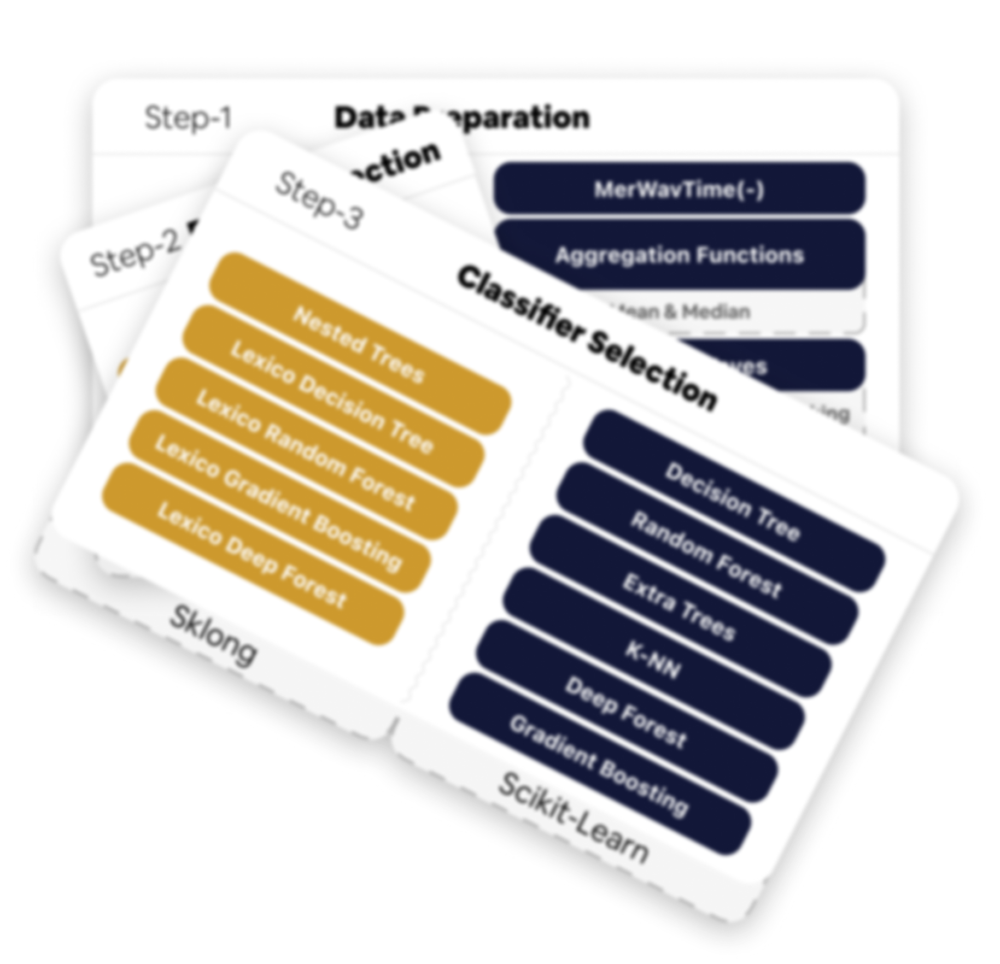

# Tutorials Overview :books:
# Tutorials Overview :books:

The following will guide you through the understanding of Auto-Sklong, an automated machine learning (AutoML) library for longitudinal data classification. Built on Scikit-Longitudinal (Sklong) and the General Machine Learning Assistant (GAMA), Auto-Sklong introduces a novel search space to automatically discover optimal pipelines tailored to temporal dependencies in your data.

We aim to provide an understanding of longitudinal datasets, how to generalize temporal dependencies, the expected data shape, and how to leverage Auto-Sklong's AutoML capabilities for efficient model building.

<figure markdown="span" style="text-align: center;">
  { width="50%" loading="lazy" }
</figure>

## :books: Overview of Tutorials

-   :fontawesome-solid-timeline:{ .lg .middle } __Temporal Dependency__

    ---

    Learn how to set up temporal dependencies using `features_group` and `non_longitudinal_features`. Essential for Auto-Sklong's search space. 🚨— This redirects to the Sklong tutorial, as it is a fundamental concept for understanding Auto-Sklong.

    [:octicons-arrow-right-24: Read the tutorial](https://scikit-longitudinal.readthedocs.io/latest/tutorials/temporal_dependency/)

-   :material-table:{ .lg .middle } __Understanding Wide/Long format__

    ---

    Understand wide vs. long formats and why `Sklong` (What `Auto-Sklong` is using) prefers wide. Includes loading and preparing data. 🚨— This redirects to the Sklong tutorial, as it is a fundamental concept for understanding Auto-Sklong.

    [:octicons-arrow-right-24: Read the tutorial](https://scikit-longitudinal.readthedocs.io/latest/tutorials/sklong_longitudinal_data_format/)

-   :material-magnify-scan:{ .lg .middle } __The Search Space__

    ---

    Dive into Auto-Sklong's novel sequential search space for longitudinal pipelines.

    [:octicons-arrow-right-24: Read the tutorial](search_space.md)

-   :rocket:{ .lg .middle } __Start with Auto-Sklong__

    ---

    A step-by-step guide to running your first AutoML experiment with Auto-Sklong.

    [:octicons-arrow-right-24: Read the tutorial](start_with_auto_sklong.md)

