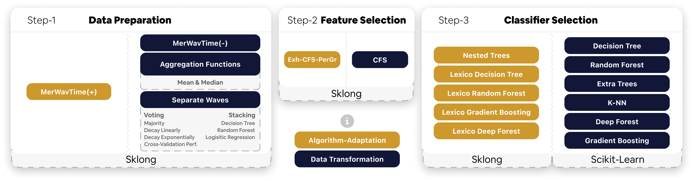

# 🕸️ The Search Space
# 🕸️ The Search Space

!!! warning "Read the full paper"

    If you are missing some context when reading the quick start on our proposed search space below.

    We highly recommend that you start reading the paper to gain a better 
    understanding of the intrinsic of our proposed search space.

The `Auto-Sklong` proposed `sequantial` search space consists of three steps for preparing a pipeline for a 
longitudinal machine learning classification task. The search space is defined by the steps below:

!!! abstract "Sequential Search Space in Three Steps"

    1. **Data Preparation**: The first step is to either `flatten` the data or retain its temporal identity for use in subsequent steps.
        - **Data Transformation**: A number of techniques use the dataset's temporal identity to `flatten` it, 
        allowing standard machine learning techniques to be applied. Certain are very basics, with some e.g waves 
        summarised via mean/median, or more complex techniques such as `Separate Waves`, which build a classifier for each 
        wave of the data before combining the results with either classic or more complex ensembling techniques.
        - **Algorithm Adaptation**: The second type of potential data preparation is simply preserving the dataset's 
        temporal identity so that subsequent steps using adapted techniques to understand such temporality can benefit it.
    2. **Pre-Processing**: The second step is to pre-process the data using feature selections from our first version of 
        the proposed search space. In theory, any type of preprocessing could be used. Feel free to add yours to [`Sklong`](https://simonprovost.github.io/scikit-longitudinal/). 
        However, here is where the important process begins. Based on the previous step's choice, the pipeline has a limited 
        number of options that only fit the previous step's choice. For example, if the previous step was to begin with 
        algorithm adaptation-based data preparation techniques, a brand-new or adapted-to-standard preprocessing technique 
        for longitudinal data would be chosen rather than standard preprocessing techniques, which do not deal with the 
        temporal identity of the dataset. Similarly, if data transformations were performed instead, an algorithm 
        adaptation-based pipeline would no longer possible. Instead, a standard machine learning technique would be chosen.
    3. **Classifiers**: The last step is to select the pipeline's final classifier. Similarly, the decision is based on 
        the previous two steps.

    Here is a figure that may be useful for visualising the search space. In the meantime, we strongly recommend that 
    the reader read the paper (which currently is sent to a conference) to gain a better understanding of the intrinsic 
    nature of our proposed search space.

    

## 🛠️ How to modify the current Search Space?

First and foremost, [`GAMA`](https://openml-labs.github.io/gama/master/index.html#), and similary `Auto-Sklong`
support [`ConfigSpace`](https://automl.github.io/ConfigSpace/main/index.html). Which, in a nutshell,
is a simple python package to manage configuration spaces for algorithm configuration and 
hyperparameter optimization tasks. It includes various modules to translate between different text formats 
for configuration space descriptions. [Read further their documentation if you are not familiar with it](https://automl.github.io/ConfigSpace/main/index.html).

In the meantime, here is how it is done in [`GAMA`](https://openml-labs.github.io/gama/master/index.html#) / `Auto-Sklong`:

### Data Preparation Techniques

Navigate first through the `gama/configuration/longitudinal_classification_task/data_preparation.py` file. 
Every step of the search space has a dedicated file. Within which, they follow the same convention to define techniques to add
to the search space. For the `Data Preparation`, see as follow.

`self.data_preparation_setup_map` defines the list of techniques to be used in the search space. However, it is of form
object-based key-value pair. This means that while defining the name of the technique, you also reference
a function that will be called to form the hyper-parameters associated with this technique.

Let's take an example. I want to add `Aggregation Functions Mean` to the search space. Such function simply aggregate waves
together using the mean function. See its documentation in [`Sklong`](https://simonprovost.github.io/scikit-longitudinal/API/data_preparation/aggregation_function/).

```python
self.data_preparation_setup_map = {
            "AggrFuncMean": self.setup_aggr_func_mean,
            ... 
}

...

def setup_aggr_func_median(self, data_preparation: csh.CategoricalHyperparameter):
    pass
```

This way, `AggrFuncMean` been added to the search space and later will be used in the pipeline by its very name.
Therefore this means that it should be available within either `Scikit-Learn` or [`Sklong`](https://simonprovost.github.io/scikit-longitudinal/).

To see how to configure hyper-parameters, let's jump into adding a pre-processing technique instead, step-2 of the search space.

### Pre-Processing Techniques

Similarly, it follows the same convention. Navigate to `gama/configuration/longitudinal_classification_task/preprocessors.py` file.

`self.preprocessors_setup_map` defines the list of preprocessing techniques to be used in the search space. Let's add
one feature selection technique with associated hyper-parameters.

```python
self.preprocessors_setup_map = {
            "CorrelationBasedFeatureSelectionPerGroup": self.setup_cfs_per_group,
            ... 
}

def setup_cfs_per_group(self, preprocessors: csh.CategoricalHyperparameter):
    version = csh.CategoricalHyperparameter(
        name="version__CorrelationBasedFeatureSelectionPerGroup",
        choices=[1, 2],
        default_value=1,
    )
    self._add_hyperparameters_and_equals_conditions(
        locals(), "CorrelationBasedFeatureSelectionPerGroup"
    )
```

This way, `CorrelationBasedFeatureSelectionPerGroup` been added to the search space and later will be used in the 
pipeline by its very name. Along with the hyper-parameter's name `version` with as choices `[1, 2]` and a default value of `1`.
Here is used what do we call a `CategoricalHyperparameter`. To define it to the `CorrelationBasedFeatureSelectionPerGroup`
you certainly have noticed that `__` symbols are added followed by the name of the technique. This ensures that if multiple techniques
have a hyper-parameter `version`, `ConfigSpace` could differentiate them.

Therefore, to understand more about the type of hyper-parameters you can define, please refer to the [`ConfigSpace`](https://automl.github.io/ConfigSpace/main/api/hyperparameters.html) documentation.

Lastly, the name put to the technique should be available within either `Scikit-Learn` or [`Sklong`](https://simonprovost.github.io/scikit-longitudinal/).

Lastly, let's jump into the last step of the search space, the classifiers.

### Classifiers

Similarly, we repeat the process, navigate to `gama/configuration/longitudinal_classification_task/classifiers.py` file.

`self.classifiers_setup_map` defines the list of classifiers to be used in the search space. Let's add a standard `DecisionTree`.

```python
self.classifiers_setup_map = {
            "DecisionTree": self.setup_decision_tree,
            ... 
}

@property
    def shared_hyperparameters(self):
        return {
            "criterion": ["gini", "entropy"],
            "min_samples_split": {"lower": 2, "upper": 20, "default_value": 2},
            "min_samples_leaf": {"lower": 1, "upper": 20, "default_value": 1},
            "max_depth": {"lower": 2, "upper": 10, "default_value": 2},
        }

def setup_decision_tree(self, classifiers: csh.CategoricalHyperparameter):
    criterion = csh.CategoricalHyperparameter(
        "criterion__DecisionTreeClassifier",
        self.shared_hyperparameters["criterion"],
    )
    min_samples_split = csh.UniformIntegerHyperparameter(
        "min_samples_split__DecisionTreeClassifier",
        **self.shared_hyperparameters["min_samples_split"],
    )
    min_samples_leaf = csh.UniformIntegerHyperparameter(
        "min_samples_leaf__DecisionTreeClassifier",
        **self.shared_hyperparameters["min_samples_leaf"],
    )
    max_depth = csh.UniformIntegerHyperparameter(
        "max_depth__DecisionTreeClassifier",
        **self.shared_hyperparameters["max_depth"],
    )
    self._add_hyperparameters_and_equals_conditions(
        locals(), "DecisionTreeClassifier"
    )
```

This way, `DecisionTree` been added to the search space and later will be used in the pipeline by its very name. Along with the hyper-parameters
`criterion`, `min_samples_split`, `min_samples_leaf`, and `max_depth`. Each with their own default values and ranges.
However, here you could notice a `shared_hyperparameters` property. This is to ensure that if multiple classifiers have 
the same hyper-parameters, we could re-use them. This is a good practice to avoid redundancy.

Therefore, to understand more about the type of hyper-parameters you can define, please refer to the [`ConfigSpace`](https://automl.github.io/ConfigSpace/main/api/hyperparameters.html) documentation.

Lastly, the name put to the technique should be available within either `Scikit-Learn` or [`Sklong`](https://simonprovost.github.io/scikit-longitudinal/).

!!! tip "To deep dive more into the search space"
    For instance, if you have dynamic hyper-parameters such as `max_features` in some trees ensemble, or 
    would like to understand how the constraint between steps works in practice.

    We recommend that you start reading the paper to gain a better understanding of the intrinsic,
    and then navigate to `gama/configuration/longitudinal_classification.py` file.